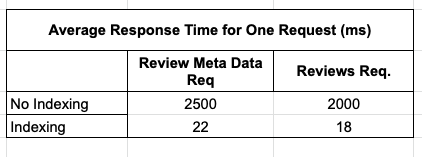
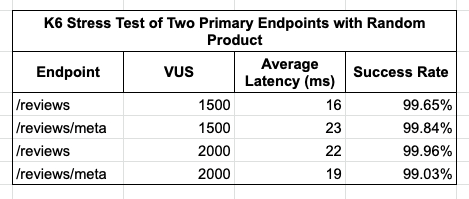
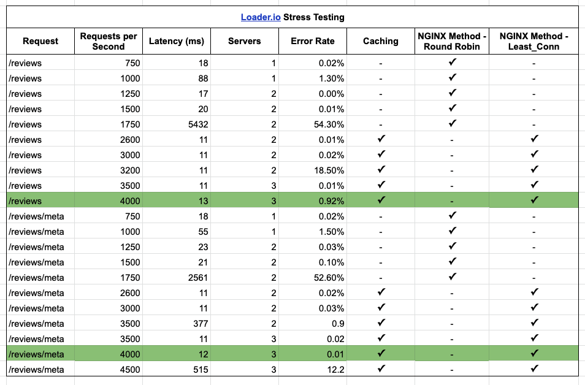

# Atelier: Database System Design, RESTful API
Developed RESTful API and database for ratings and reviews of an inherited front-end E-Commerce codebase with over 25M records in CSVs

## Tech ##

## Performance Testing ##

### Local ###

Goal:
* Decrease average query times to < 50ms (ideally less than 20ms)

Testing conditions:
* Pre and Post indexed query times using PSQL 'EXPLAIN ANALYZE' command

Goal:
* Locally handle at least 1000 VUS
* Average Response time of 200ms or less

Testing Conditions:
* K6
* request product range from 1 - 10000
* test duration 1 minute

### Deployed ###

Goal: Horizontally scale to:
* reach 5000 RPS with less than 1% error rate
* average response time less than 2000ms

Testing Conditions:
* loader.io
* request product range from 1 - 10000
* test duration 1 minute

Constraints:
* No vertical scaling
* Cannot use additional AWS services

Results:
* All requests were able to handle 4000 RPS with less than a 1% error rate.

